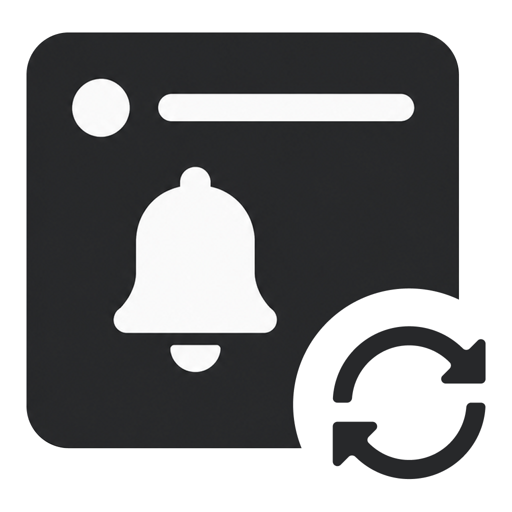
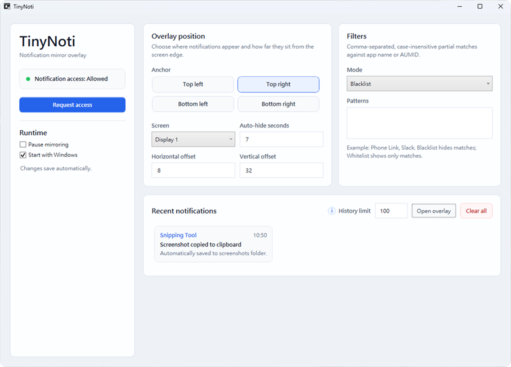
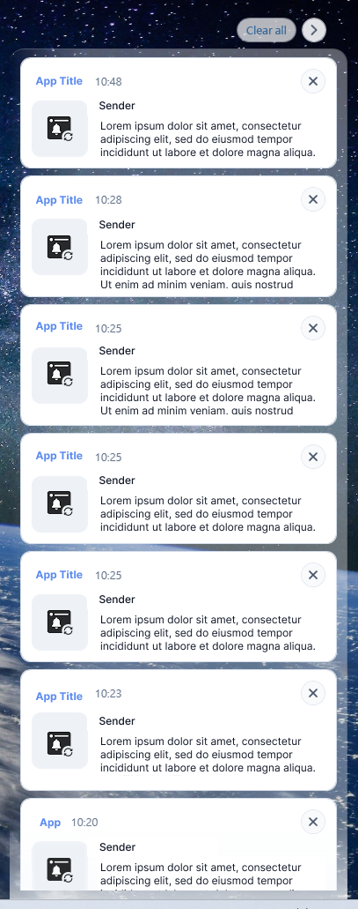

# tinynoti

<p>
  
</p>

A small Windows app that mirrors Notification Center to a configurable on-screen overlay.


tinynoti listens to Windows Notification Center and shows incoming notifications in a lightweight WPF overlay. It is meant for people who want notifications somewhere other than the default bottom-right toast position, with a small amount of control over placement, filtering, history, and mirroring behavior.

The current build targets Windows 10.0.22000.0 or newer and has only been tested on Windows 11. Windows 10 support is not currently guaranteed.

> Disclosure: this project was coded end-to-end by AI, with human review, judgment, and final decision-making throughout the process.

## Screenshots

<details open>
<summary>Main window</summary>



</details>

<details>
<summary>Recent notifications</summary>



</details>

## Features

- Mirror Windows toast notifications to a custom position.
- Choose overlay anchor, display, offset, and auto-hide timing.
- Pause or resume mirroring from the main app or the bottom-right system tray.
- Keep a local recent-notification history for the current app session.
- Filter notifications by app name or App User Model ID using blacklist or whitelist mode.
- Dismiss individual notifications or clear all mirrored notifications.
- Try to preserve notification opening behavior as much as possible: open a URL found in the notification text first, then apply app-specific rules, then try to launch the source app. Full behavior cannot be guaranteed for every notification.
- Try to show notification images when Windows provides a readable image URI.
- Store user settings under `%APPDATA%\TinyNoti\settings.json`.

## Author's Note

This project started simply because Windows notification banners sit in the bottom-right corner, and I often need that area for other things. Looking for a way to move them quietly turned into building a small app. Of course, this is undeniably a vibe-coding artifact. I cannot claim I caught every odd thing in the code, but it satisfies my own need.

## Project Structure

```text
TinyNoti.App/      WPF desktop app, tray integration, notification listener, settings UI
TinyNoti.Core/     Notification models, filtering, launch resolution, overlay placement
TinyNoti.Tests/    Lightweight console test runner for core behavior
scripts/           Local packaging scripts
assets/            README images and project visuals
```

## Requirements

- Windows 11, tested. Windows 10 is not currently guaranteed because the app targets Windows 10.0.22000.0 or newer.
- .NET 10 SDK
- Windows 10/11 SDK, required for local MSIX packaging

## Build

```powershell
dotnet build .\TinyNoti.slnx
dotnet run --project .\TinyNoti.Tests\TinyNoti.Tests.csproj
```

## Local MSIX Testing

The debug EXE can show the UI, but Windows may reject notification-listener event subscription without package identity. For testing real notification capture, register or install a local MSIX package.

Recommended local flow:

```powershell
.\scripts\package-msix.ps1 -RegisterLoose
Start-Process 'shell:AppsFolder\TinyNoti_n4dsdbrj5xmcc!TinyNoti'
```

If the package family name changes, find the launch ID with:

```powershell
Get-StartApps | Where-Object { $_.Name -like '*TinyNoti*' }
```

Signed MSIX test package flow:

```powershell
.\scripts\package-msix.ps1
Import-Certificate -FilePath .\artifacts\msix\cert\TinyNoti.cer -CertStoreLocation Cert:\CurrentUser\TrustedPeople
Import-Certificate -FilePath .\artifacts\msix\cert\TinyNoti.cer -CertStoreLocation Cert:\CurrentUser\Root
Add-AppxPackage -Path .\artifacts\msix\TinyNoti_0.1.0.0_win-x64.msix -ForceApplicationShutdown
```

Or run the package, certificate, and install steps together:

```powershell
.\scripts\package-msix.ps1 -InstallCertificate -InstallPackage
```

Then launch tinynoti from Start, press `Request access`, and test with a notification-producing action such as `Win + Shift + S`.

## Notes and Limits

- `TinyNoti.App\Package.appxmanifest` contains the intended MSIX identity, `userNotificationListener`, `runFullTrust`, and startup task declaration.
- A production MSIX still needs a production signing certificate and a release packaging workflow.
- Windows exposes stable notification text data, but not a generic public API for replaying the original toast click action.
- Opening a notification is best-effort and may vary by source app.
- Some native toast images are not exposed by `NotificationBinding`, so image display is intentionally best-effort.

## License

MIT. Share, modify, and build on it.

---

# tinynoti

<p>
  
</p>

tinynoti 是一款小型 Windows 工具，可將通知中心內容鏡像到可自訂位置的桌面浮動通知。


tinynoti 會監聽 Windows 通知中心，並用輕量的 WPF 浮動視窗顯示收到的通知。它適合想把通知放在預設右下角以外位置的人，並提供基本的顯示位置、過濾、近期紀錄與暫停鏡像設定。

目前版本以 Windows 10.0.22000.0 以上為目標，且目前僅在 Windows 11 測試通過。Windows 10 尚未保證支援。

> 揭露：本專案全程由 AI 執行編碼，並由人工進行審核、取捨與最終決策。

## 畫面截圖

<details open>
<summary>主視窗</summary>


</details>

<details>
<summary>近期通知</summary>


</details>

## 功能

- 將 Windows toast 通知鏡像到自訂位置。
- 可設定浮動通知的角落位置、螢幕、邊距與自動隱藏秒數。
- 可從主程式或右下角的系統匣暫停、恢復鏡像。
- 保留目前執行期間的近期通知紀錄。
- 可用黑名單或白名單模式，依應用程式名稱或 App User Model ID 過濾通知。
- 可關閉單一通知或清除全部鏡像通知。
- 盡可能呈現開啟通知的來源：優先開啟通知文字中的網址，其次套用應用程式規則，最後嘗試啟動來源應用程式。但無法保證全數功能可以完整呈現。
- 當 Windows 有提供可讀取的圖片 URI 時，盡可能顯示通知圖片。
- 使用者設定儲存在 `%APPDATA%\TinyNoti\settings.json`。

## 作者碎碎唸

這個專案最初單純因為 Windows 通知橫幅卡在右下角，我很多時候都會需要用到那個區塊，所以從尋找更改位置的方式就默默演變為做了個程式。當然，不可否認這就是個 vibe-coding 的產物，我沒能看出程式碼到底有什麼詭異，但總之滿足了我個人需求。

## 專案結構

```text
TinyNoti.App/      WPF 桌面程式、系統匣整合、通知監聽、設定介面
TinyNoti.Core/     通知模型、過濾、開啟目標判斷、浮動視窗位置計算
TinyNoti.Tests/    核心行為的輕量 console 測試
scripts/           本機封裝腳本
assets/            README 圖片與專案視覺素材
```

## 需求

- Windows 11，已測試。由於目前程式以 Windows 10.0.22000.0 以上為目標，Windows 10 尚未保證支援。
- .NET 10 SDK
- Windows 10/11 SDK，本機 MSIX 封裝需要使用

## 建置

```powershell
dotnet build .\TinyNoti.slnx
dotnet run --project .\TinyNoti.Tests\TinyNoti.Tests.csproj
```

## 本機 MSIX 測試

Debug EXE 可以顯示介面，但若沒有 package identity，Windows 可能會拒絕通知監聽事件訂閱。若要測試實際通知擷取，建議註冊或安裝本機 MSIX 套件。

建議的本機測試流程：

```powershell
.\scripts\package-msix.ps1 -RegisterLoose
Start-Process 'shell:AppsFolder\TinyNoti_n4dsdbrj5xmcc!TinyNoti'
```

如果 package family name 有變更，可用以下指令查詢啟動 ID：

```powershell
Get-StartApps | Where-Object { $_.Name -like '*TinyNoti*' }
```

簽署 MSIX 測試套件流程：

```powershell
.\scripts\package-msix.ps1
Import-Certificate -FilePath .\artifacts\msix\cert\TinyNoti.cer -CertStoreLocation Cert:\CurrentUser\TrustedPeople
Import-Certificate -FilePath .\artifacts\msix\cert\TinyNoti.cer -CertStoreLocation Cert:\CurrentUser\Root
Add-AppxPackage -Path .\artifacts\msix\TinyNoti_0.1.0.0_win-x64.msix -ForceApplicationShutdown
```

也可以一次執行封裝、匯入憑證與安裝：

```powershell
.\scripts\package-msix.ps1 -InstallCertificate -InstallPackage
```

接著從開始功能表啟動 tinynoti，按下 `Request access`，再用會產生通知的操作測試，例如 `Win + Shift + S`。

## 注意事項與限制

- `TinyNoti.App\Package.appxmanifest` 已包含預期的 MSIX identity、`userNotificationListener`、`runFullTrust` 與啟動工作宣告。
- 正式發布的 MSIX 仍需要正式簽署憑證與發布封裝流程。
- Windows 可以提供穩定的通知文字資料，但沒有通用公開 API 可重播原本 toast 的點擊動作。
- 開啟通知來源是盡力處理，實際結果可能依來源應用程式而不同。
- 部分原生 toast 圖片不會透過 `NotificationBinding` 暴露，因此圖片顯示也是盡力處理。

## 授權

MIT。歡迎分享、修改與延伸使用。
