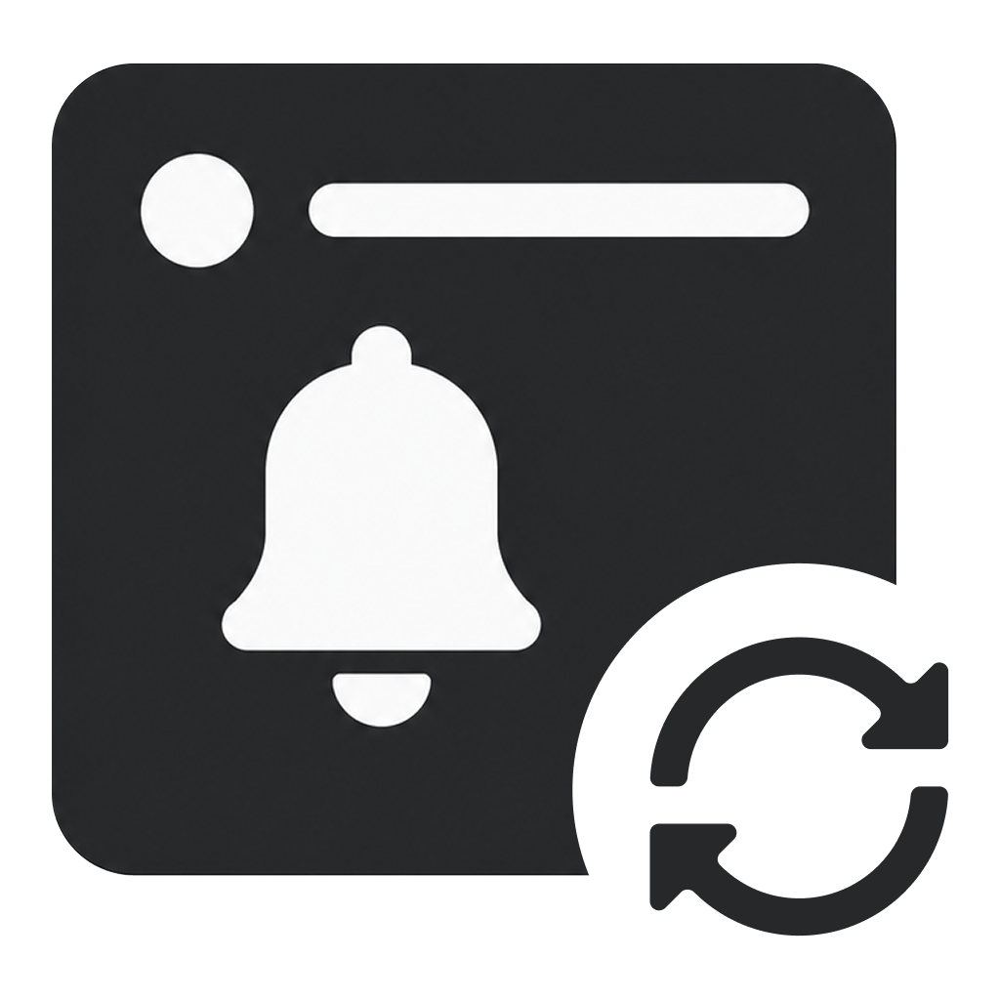
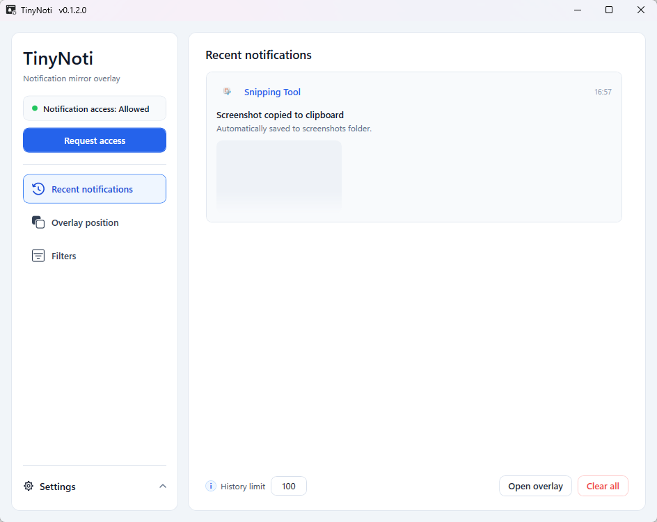
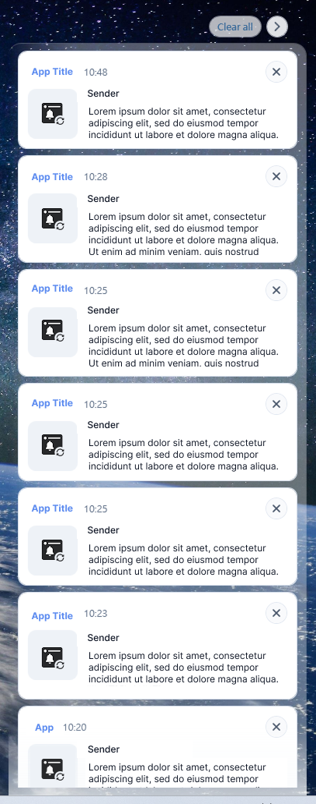

# tinynoti

<p>
  
</p>

A small Windows app that mirrors Notification Center to a configurable on-screen overlay.


tinynoti listens to Windows Notification Center and shows incoming notifications in a lightweight WPF overlay. It is meant for people who want notifications somewhere other than the default bottom-right toast position, with a small amount of control over placement, filtering, history, and mirroring behavior.

The current build targets Windows 10.0.22000.0 or newer and has only been tested on Windows 11. Windows 10 support is not currently guaranteed.

> Disclosure: this project was coded end-to-end by AI, with human review, judgment, and final decision-making throughout the process.

## Screenshots

<details open>
<summary>Main window</summary>



</details>

<details>
<summary>Recent notifications</summary>



</details>

## Features

- **Custom Overlay Placement**: Mirror Windows toast notifications to any screen corner with configurable offsets, multi-monitor support, and custom auto-hide timers.
- **Adaptive Frosted Glass Chrome**: Seamlessly hugs cards as a compact floating island when few notifications are present, and expands to full screen height with smooth scrolling and subtle bottom gradient fade when filled.
- **Notification Deep Linking**: Reads underlying Windows notification database (`wpndatabase.db`) and parses Toast XML payloads to extract direct deep links for Slack (channels, direct messages, and threads) and Asana (task URLs), beyond generic app launching.
- **Modern Three-Tab Navigation**: Clean, organized interface with dedicated tabs for Recent notifications, Overlay position settings, and Notification filtering, plus a collapsible global Settings panel.
- **Refined Notification Cards**: High-hierarchy layout with circular sender avatars, timestamp, clear app branding, and 1/2 card width image previews with smooth bottom gradient fade.
- **Flexible App Filtering**: Filter notifications by app name or App User Model ID (AUMID) using Blacklist or Whitelist modes.
- **System Tray Controls**: Quickly pause/resume mirroring, view recent notifications, or clear all mirrored notifications directly from the tray icon.
- **Lightweight & Persistent**: Native WPF performance, low memory footprint, and settings saved automatically to `%APPDATA%\TinyNoti\settings.json`.

## Author's Note

This project started simply because Windows notification banners sit in the bottom-right corner, and I often need that area for other things. Looking for a way to move them quietly turned into building a small app. Of course, this is undeniably a vibe-coding artifact. I cannot claim I caught every odd thing in the code, but it satisfies my own need.

## Project Structure

```text
TinyNoti.App/      WPF desktop app, tray integration, notification listener, settings UI
TinyNoti.Core/     Notification models, filtering, launch resolution, overlay placement
TinyNoti.Tests/    Lightweight console test runner for core behavior
scripts/           Local packaging scripts
assets/            README images and project visuals
```

## Installation

### Option A: Install MSIX Package (Recommended for Users)

1. Download `TinyNoti_1.0.0.0_win-x64.zip` from [Releases](https://github.com/kuozher/tinynoti/releases) and extract it.
2. Double-click `TinyNoti.cer` ➔ Click **Install Certificate** ➔ Select Store Location **Current User** ➔ Place certificate in **Trusted People** (or **Trusted Root Certification Authorities**).
3. Double-click `TinyNoti_1.0.0.0_win-x64.msix` to complete installation.
4. Launch **TinyNoti** from the Start Menu, then click **Request access** in the main window to grant notification permissions.

> [!TIP]
> **Recommended Windows Notification Setup**:  
> Installing TinyNoti does not automatically disable native Windows notification banners. We recommend going to Windows **Settings > System > Notifications**, finding your frequent notification apps, and unchecking **"Show notification banners"** while keeping notifications enabled. This allows notifications to arrive quietly in Notification Center without bottom-right popup clutter, and TinyNoti will mirror and present them smoothly where you want!

### Option B: Build & Test from Source (For Developers)

**Requirements**:
- Windows 11 (tested on build 22000 or newer)
- .NET 10 SDK
- Windows 10/11 SDK (required for local MSIX packaging)

**Build & Run Tests**:
```powershell
dotnet build .\TinyNoti.slnx
dotnet run --project .\TinyNoti.Tests\TinyNoti.Tests.csproj
```

**Local Loose MSIX (Fastest Dev Loop)**:
```powershell
.\scripts\package-msix.ps1 -RegisterLoose
Start-Process 'shell:AppsFolder\TinyNoti_n4dsdbrj5xmcc!TinyNoti'
```

## Notes and Limits

- `TinyNoti.App\Package.appxmanifest` contains the intended MSIX identity, `userNotificationListener`, `runFullTrust`, and startup task declaration.
- A production MSIX still needs a production signing certificate and a release packaging workflow.
- Windows exposes stable notification text data, but not a generic public API for replaying the original toast click action.
- Opening a notification is best-effort and may vary by source app.
- Some native toast images are not exposed by `NotificationBinding`, so image display is intentionally best-effort.

## License

MIT. Share, modify, and build on it.

---

# tinynoti

<p>
  
</p>

tinynoti 是一款小型 Windows 工具，可將通知中心內容鏡像到可自訂位置的桌面浮動通知。


tinynoti 會監聽 Windows 通知中心，並用輕量的 WPF 浮動視窗顯示收到的通知。它適合想把通知放在預設右下角以外位置的人，並提供基本的顯示位置、過濾、近期紀錄與暫停鏡像設定。

目前版本以 Windows 10.0.22000.0 以上為目標，且目前僅在 Windows 11 測試通過。Windows 10 尚未保證支援。

> 揭露：本專案全程由 AI 執行編碼，並由人工進行審核、取捨與最終決策。

## 畫面截圖

<details open>
<summary>主視窗</summary>


</details>

<details>
<summary>近期通知</summary>


</details>

## 功能

- **自訂浮動通知位置**：將 Windows 通知鏡像至指定螢幕角落，自由設定水平與垂直邊距、支援多螢幕選取與自訂自動隱藏秒數。
- **自適應磨砂玻璃外觀**：卡片少時自動收合為精緻的四邊圓角懸浮島嶼；卡片多時自適應撐滿螢幕高度，支援順暢滾動與優雅的下緣漸層遮罩。
- **深度跳轉（Deep Linking）**：深度讀取 Windows 底層通知資料庫（`wpndatabase.db`）並解析 Toast XML Payload，突破點擊通知僅能開啟首頁的限制，直接跳轉 Slack 頻道／私訊討論串與 Asana 任務連結。
- **全新三欄現代化介面**：清晰的分頁架構（近期通知、浮動視窗位置、過濾清單）以及左下角平滑展開收合的 Settings 設定面板。
- **高質感卡片排版**：由上而下清晰資訊層次、圓形發送者頭像，以及 1/2 卡片寬度並帶有下緣漸層過渡的附件圖片預覽。
- **應用程式過濾機制**：支援黑名單與白名單模式，可依據應用程式名稱或 AUMID 精準篩選。
- **系統匣快捷操作**：右下角系統匣選單可一鍵暫停／恢復鏡像、開啟近期通知或清除所有桌面通知。
- **輕量且自動持久化**：原生 WPF 打造、資源佔用極低，所有設定自動保存於 `%APPDATA%\TinyNoti\settings.json`。

## 作者碎碎唸

這個專案最初單純因為 Windows 通知橫幅卡在右下角，我很多時候都會需要用到那個區塊，所以從尋找更改位置的方式就默默演變為做了個程式。當然，不可否認這就是個 vibe-coding 的產物，我沒能看出程式碼到底有什麼詭異，但總之滿足了我個人需求。

## 專案結構

```text
TinyNoti.App/      WPF 桌面程式、系統匣整合、通知監聽、設定介面
TinyNoti.Core/     通知模型、過濾、開啟目標判斷、浮動視窗位置計算
TinyNoti.Tests/    核心行為的輕量 console 測試
scripts/           本機封裝腳本
assets/            README 圖片與專案視覺素材
```

## 安裝方式

### 方法 A：直接安裝封裝套件（一般使用者推薦）

1. 前往 [Releases 發布頁面](https://github.com/kuozher/tinynoti/releases) 下載最新版的 `TinyNoti_1.0.0.0_win-x64.zip` 並解壓縮。
2. 雙擊 `TinyNoti.cer` ➔ 點擊「安裝憑證」➔ 存放區位置選擇「目前使用者」➔ 將憑證放入「**信任的人**」（或「受信任的根憑證授權單位」）。
3. 雙擊 `TinyNoti_1.0.0.0_win-x64.msix` 即可完成安裝。
4. 從開始功能表啟動 **TinyNoti**，於主視窗點擊「Request access」按鈕授權通知存取權限。

> [!TIP]
> **推薦的 Windows 通知搭配設定**：  
> 安裝 TinyNoti 並不會自動關閉 Windows 原生通知橫幅。建議前往 Windows 的「**設定 > 系統 > 通知**」，找到您常跳通知的應用程式，將「**顯示通知橫幅**」取消勾選（保留在通知中心顯示）。如此一來，通知就會安靜地進入通知中心，由 TinyNoti 優雅地鏡像到您指定的位置，不會在螢幕右下角重複彈出！

### 方法 B：從原始碼建置與測試（開發者）

**需求**：
- Windows 11（版本 22000 以上）
- .NET 10 SDK
- Windows 10/11 SDK（本機封裝 MSIX 需要使用）

**編譯與執行單元測試**：
```powershell
dotnet build .\TinyNoti.slnx
dotnet run --project .\TinyNoti.Tests\TinyNoti.Tests.csproj
```

**本機 Loose MSIX 註冊（推薦快速除錯流程）**：
```powershell
.\scripts\package-msix.ps1 -RegisterLoose
Start-Process 'shell:AppsFolder\TinyNoti_n4dsdbrj5xmcc!TinyNoti'
```

## 注意事項與限制

- `TinyNoti.App\Package.appxmanifest` 已包含預期的 MSIX identity、`userNotificationListener`、`runFullTrust` 與啟動工作宣告。
- 正式發布的 MSIX 仍需要正式簽署憑證與發布封裝流程。
- Windows 可以提供穩定的通知文字資料，但沒有通用公開 API 可重播原本 toast 的點擊動作。
- 開啟通知來源是盡力處理，實際結果可能依來源應用程式而不同。
- 部分原生 toast 圖片不會透過 `NotificationBinding` 暴露，因此圖片顯示也是盡力處理。

## 授權

MIT。歡迎分享、修改與延伸使用。
